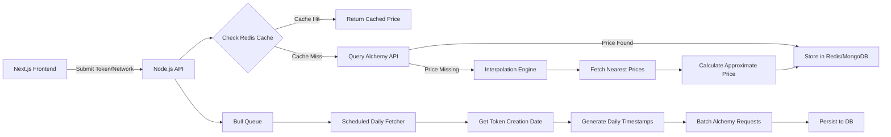

# Historical Token Price Oracle with Interpolation Engine

A full-stack application that provides historical token price data with intelligent interpolation capabilities. Built with Next.js frontend and Node.js backend, featuring Redis caching, MongoDB storage, and BullMQ job queues.

## 🚀 Features

- **Historical Price Lookup**: Get token prices for any specific timestamp
- **Intelligent Interpolation**: Calculate approximate prices when exact data is unavailable
- **Scheduled History Fetching**: Automatically fetch complete price history from token creation
- **Redis Caching**: 5-minute TTL for fast price lookups
- **Job Queue Processing**: Asynchronous background processing with BullMQ
- **Multi-Network Support**: Ethereum and Polygon networks
- **Real-time Progress Tracking**: Monitor scheduled job progress
- **Responsive UI**: Modern, mobile-friendly interface

## 🏗️ Architecture



## 📋 Prerequisites

- Node.js (v16 or higher)
- MongoDB (local or cloud instance)
- Redis (local or cloud instance)
- Alchemy API key

## 🛠️ Installation

### 1. Clone the repository
```bash
git clone <repository-url>
cd InternAssignment1
```

### 2. Backend Setup
```bash
cd backend
npm install
cp env.example .env
```

Edit the `.env` file with your configuration:
```env
PORT=3000
NODE_ENV=development
MONGODB_URI=mongodb://localhost:27017/price_oracle
REDIS_URL=redis://localhost:6379
ALCHEMY_API_KEY=your_alchemy_api_key_here
ALCHEMY_NETWORK=eth-mainnet
JWT_SECRET=your_jwt_secret_here
```

### 3. Frontend Setup
```bash
cd ../frontend
npm install
```

### 4. Start the application

**Backend:**
```bash
cd backend
npm run dev
```

**Frontend:**
```bash
cd frontend
npm run dev
```

The application will be available at:
- Frontend: http://localhost:3001
- Backend API: http://localhost:3000

## 📚 API Documentation

### Price Lookup
```http
GET /api/price-oracle/price?token=0xA0b869...c2d6&network=ethereum&timestamp=1678901234
```

**Response:**
```json
{
  "price": 0.9998,
  "source": "cache|alchemy|interpolated",
  "timestamp": 1678901234,
  "cached": true,
  "interpolation": {
    "beforePrice": {...},
    "afterPrice": {...}
  }
}
```

### Schedule History Fetch
```http
POST /api/price-oracle/schedule
Content-Type: application/json

{
  "token": "0x1f9840...85d5",
  "network": "polygon"
}
```

**Response:**
```json
{
  "message": "Price history fetch scheduled successfully",
  "jobId": "job_123",
  "token": "0x1f9840...85d5",
  "network": "polygon",
  "creationDate": "2023-01-01T00:00:00.000Z",
  "status": "pending"
}
```

### Job Status
```http
GET /api/price-oracle/jobs/:jobId
```

**Response:**
```json
{
  "jobId": "job_123",
  "status": "processing",
  "progress": 50,
  "totalDays": 365,
  "processedDays": 182,
  "error": null
}
```

## 🔧 Core Components

### Backend Structure
```
backend/
├── config/
│   ├── database.js      # MongoDB connection
│   ├── redis.js         # Redis configuration
│   └── alchemy.js       # Alchemy SDK setup
├── models/
│   ├── TokenPrice.js    # Price data model
│   └── ScheduledJob.js  # Job tracking model
├── services/
│   └── priceService.js  # Price fetching logic
├── utils/
│   └── interpolation.js # Interpolation engine
├── queues/
│   └── priceHistoryQueue.js # BullMQ job queue
├── routes/
│   └── priceOracle.js   # API endpoints
└── index.js             # Main server file
```

### Frontend Structure
```
frontend/
├── app/
│   ├── layout.tsx       # Root layout
│   ├── page.tsx         # Main page component
│   └── globals.css      # Global styles
├── lib/
│   └── store.ts         # Zustand state management
└── package.json
```

## 🧮 Interpolation Algorithm

The system uses linear interpolation to calculate approximate prices:

```javascript
function interpolatePrice(targetTimestamp, beforeTimestamp, beforePrice, afterTimestamp, afterPrice) {
  const ratio = (targetTimestamp - beforeTimestamp) / (afterTimestamp - beforeTimestamp);
  return beforePrice + (afterPrice - beforePrice) * ratio;
}
```

## 🔄 Job Queue Processing

- **Queue**: `price-history-fetch`
- **Concurrency**: 2 jobs processed simultaneously
- **Retry Logic**: 3 attempts with exponential backoff
- **Batch Processing**: 10 dates per batch to respect rate limits
- **Progress Tracking**: Real-time progress updates

## 🧪 Testing

### Test Case 1: Exact Timestamp
```bash
curl -X GET "http://localhost:3000/api/price-oracle/price?token=0xA0b86991c6218b36c1d19D4a2e9Eb0cE3606eB48&network=ethereum&timestamp=1678901234"
```

### Test Case 2: Interpolation (Weekend)
```bash
curl -X GET "http://localhost:3000/api/price-oracle/price?token=0x1f9840a85d5aF5bf1D1762F925BDADdC4201F984&network=polygon&timestamp=1679032800"
```

### Test Case 3: Schedule History
```bash
curl -X POST "http://localhost:3000/api/price-oracle/schedule" \
  -H "Content-Type: application/json" \
  -d '{"token":"0x1f9840a85d5aF5bf1D1762F925BDADdC4201F984","network":"polygon"}'
```

## 🚨 Error Handling

- **Rate Limiting**: Exponential backoff with `p-retry`
- **Network Errors**: Graceful fallback to interpolation
- **Invalid Tokens**: Proper error messages
- **Job Failures**: Automatic retry with error logging

## 📊 Monitoring

- Health check endpoint: `GET /health`
- Job status tracking
- Database connection monitoring
- Redis cache status
- API response times

## 🔒 Security Considerations

- Input validation for all endpoints
- Rate limiting on API calls
- Secure environment variable handling
- CORS configuration
- Error message sanitization

## 🚀 Deployment

### Environment Variables
```env
NODE_ENV=production
MONGODB_URI=mongodb://your-production-db
REDIS_URL=redis://your-production-redis
ALCHEMY_API_KEY=your-production-key
```

### Build Commands
```bash
# Backend
cd backend
npm run build

# Frontend
cd frontend
npm run build
```

## 🤝 Contributing

1. Fork the repository
2. Create a feature branch
3. Make your changes
4. Add tests if applicable
5. Submit a pull request

## 📄 License

ISC License

## 📞 Support

For questions or issues, please create an issue in the repository.

---

**Built with ❤️ using Next.js, Node.js, Redis, MongoDB, and BullMQ** 